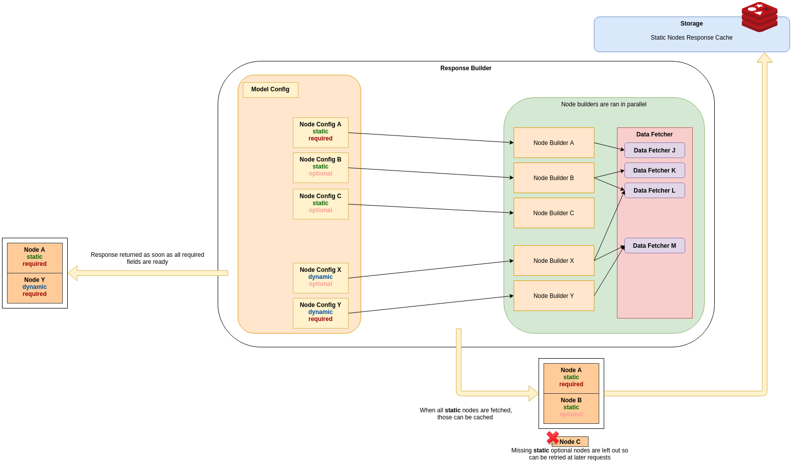
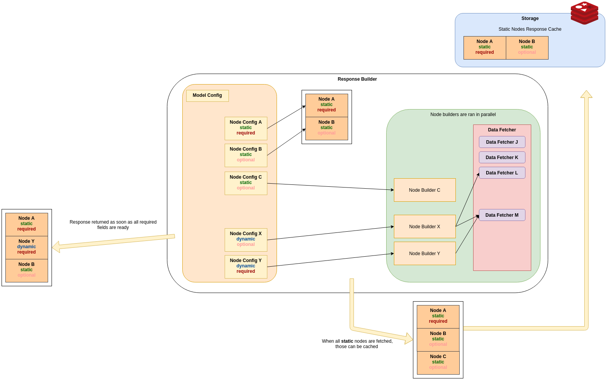

# datablocks
Parallel data fetching library

## Requirements for a composed response

When have some endpoints that will be called repeteadly to get the
**model** (response) for a given **client phase/state** and we want
to make those calls fast and efficient.

We call a **node** a piece of information in the response, that is independent
of the other information and that can be constructed with some independent
business logic.

A response is composed by gathering different **nodes** that (even are
built independently) might require the same fetched data than other nodes, but
we still want to keep the node building part as independent as possible.

For a given **phase** some of the **nodes** do not change in succesive
calls. This way we classify them as either `static` (do not change for a given
phase) or `dynamic` (information for that node should be refreshed on each request).

Also, for a given **phase** some of the **nodes** information **MUST** be there and we
call them `required` as opposed to some other **nodes** that can be missing in
the response that are `optional` (and the client making the request must be able
to work with that missing information).

Node builder logic **does not know** if the node is `required` or `optional`, or
if is `dynamic` or `static`. That is not his concern.

## Caching static **nodes** for a given phase

**_Warning_**: this is caching for built full nodes, not individual service
requests (or data fetching requests).

We want to build a service that caches those nodes that are not going to change at a given phase,
so repeated requests do not hit our internal services to fetch non modified data.

So, for each request we will have a "Response Builder", that given a _**Response Model Configuration**_
is able to launch in parallel different node builders,
and create a **valid response** as fast as possible. A **valid response is one that contains at least
all required fields**.

Take a look at the following diagram (you might need to open in in a separate tab to see it well), that
pictures the how it would work on the first request:

We do not wait for the full building process to provide a response, but once the building process is
finished we can cache all the successful built **static** nodes.

This way, the next time we call the response builder again for the same phase, we will be able to
fetch from the storage the nodes we already built, and we can build those nodes that failed to build
in the last run.

The optimal case will be when all static nodes are already in our storage.

#### Retry Policy

There is no retry policy in a single "run" (inside a single request):

- If required data fails to be fetched, everything is cancelled

- If is the first attempt (nothing cached yet), the returned result will
    be only required data: optional data will be saved once is fetched to
    the storage.

- If is the second run, the returned data will be only what is stored in
    result cache. Missing optional data will be fetched, and stored for
    a later request.

#### Dynamic optional nodes

This nodes are an special case, because our policy is to return a **valid response** as soon
as possible. So, in the most common case, when all static nodes are cached, if we have these
kind of nodes we need to wait for that response for at least some time (otherwise, we have
high chances that we will never add it to the response because the rest of the required nodes
will be more faster to retrieve).

#### Dynamic stale nodes ?

Not to be implemented now, but we could have the ability to allow dynamic nodes to be stale:
we serve the results from the previous run, while we fetch a new one.

# WARNING

**Data fetched should not be modified** as it might be shared across different goroutines.
We cannot enforce that unless we do copies (that we are not doing right now, because
we just save references to data, and would probably need reflection).
